# 🏟 Sporting Club Management System

## 📌 Overview
The **Sporting Club Management System** is a **Java-based database project** designed to streamline the management of a sporting club’s daily operations.  
It enables the administration to manage **members, teams, events, sponsors, experts, and reports** in an efficient and scalable way.  
The project integrates **JavaFX (FXML for UI)**, **MySQL database (JDBC)**, **XML configuration files**, and **UI/UX prototypes initially designed in Figma** and implemented in FXML.

---

## 🎨 UI/UX Design
- **Designed in Figma:** All 12 screens were first designed as wireframes in Figma for a modern and intuitive user experience.  
- **Implemented in FXML:** Converted the Figma designs into **JavaFX FXML files** for an interactive desktop application.  
- **Responsive Layouts:** Each screen is styled with CSS for a clean and professional look.

---

## 🚀 Key Features
- ✅ **User Dashboard:** 12 interactive screens for different modules (Login, Members, Teams, Events, Reports, Notifications, etc.).  
- ✅ **Database Integration:** MySQL relational database connected via **JDBC**.  
- ✅ **CRUD Operations:** Add, edit, delete, and search for members, teams, and events.  
- ✅ **XML Support:** Read and write configuration data from XML files.  
- ✅ **Reporting System:** Generate statistical reports for club activities and payments.  
- ✅ **Scalable Architecture:** Built with **Java MVC pattern** for maintainability.  

---

## 🛠 Tech Stack
- **Backend:** Java 17 (OOP, MVC Architecture)  
- **Frontend:** JavaFX (FXML) + CSS Styling  
- **Database:** MySQL (Relational DB with JDBC)  
- **Configuration:** XML files  
- **UI/UX Design:** Figma → FXML implementation  
- **Build Tool:** Maven for project dependencies  

---

# 💻 UI Preview

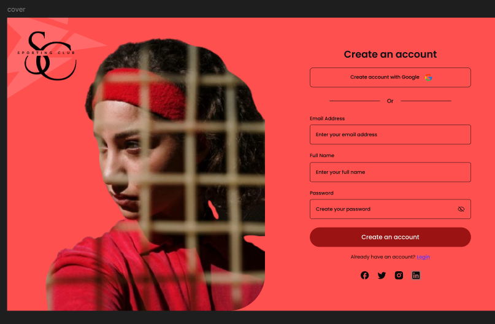
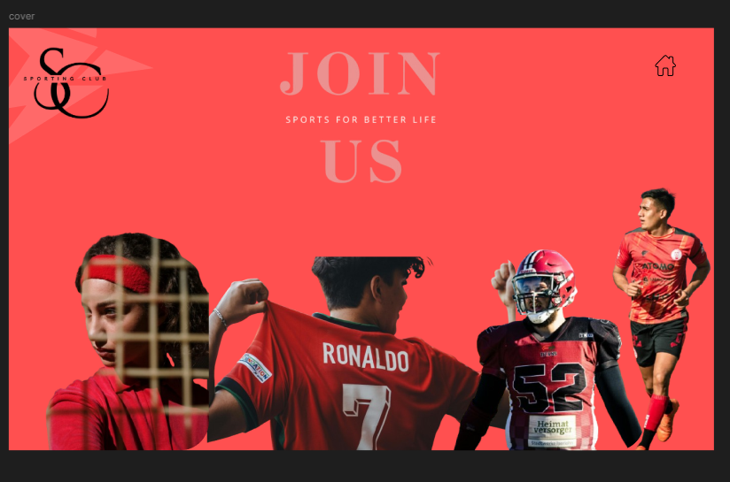
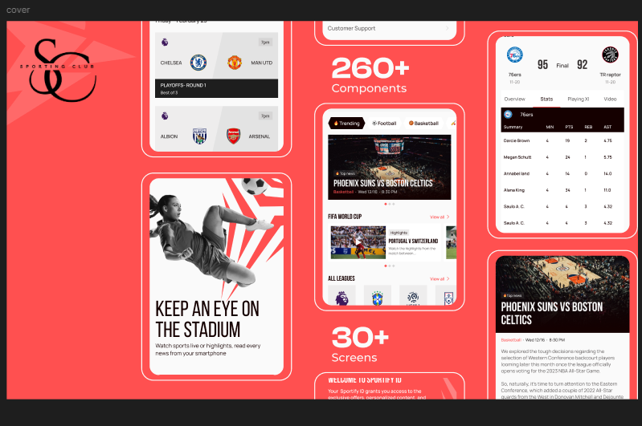
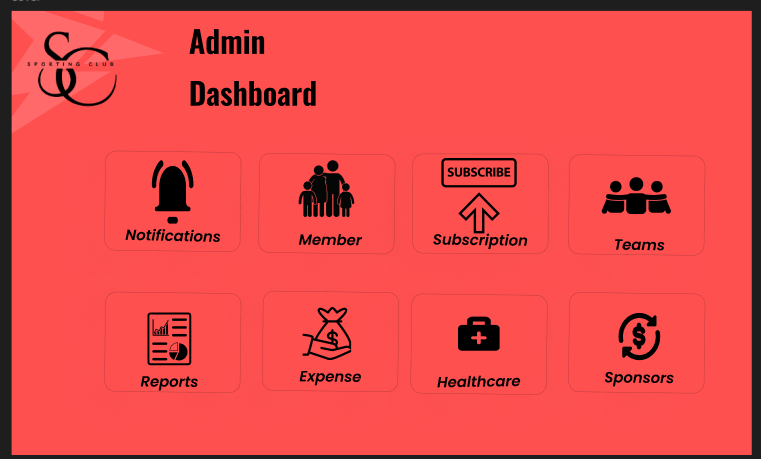
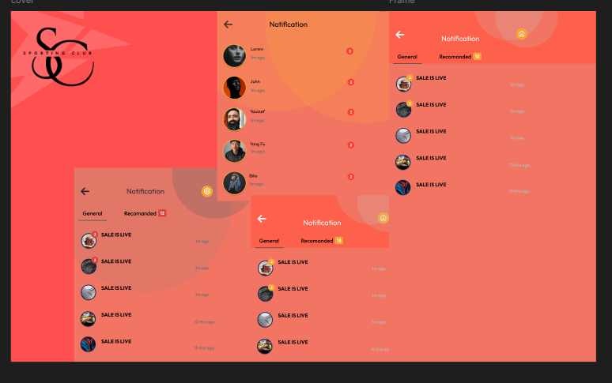
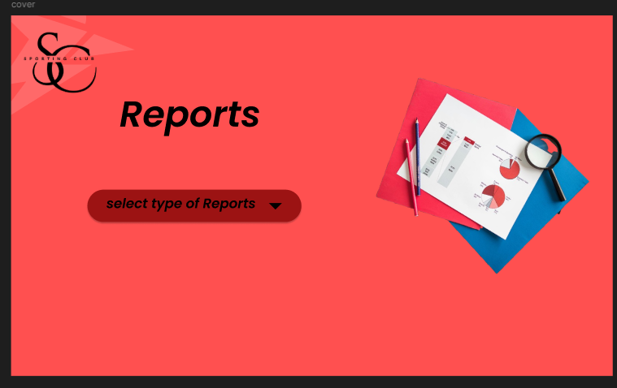
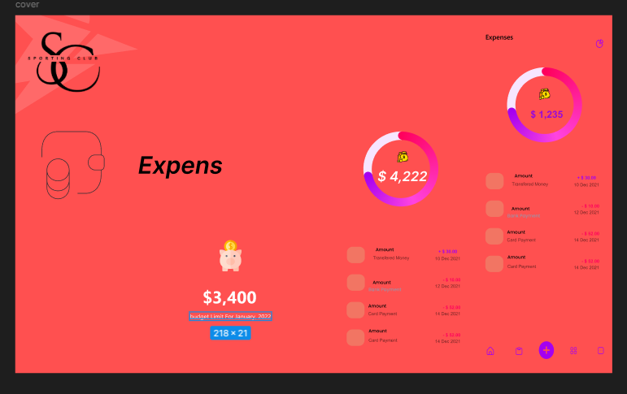
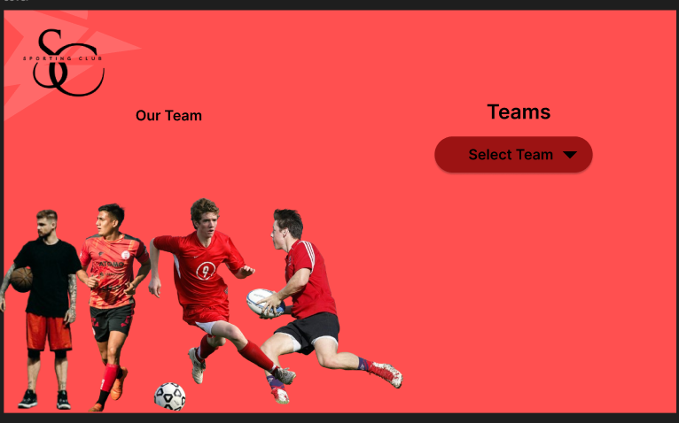
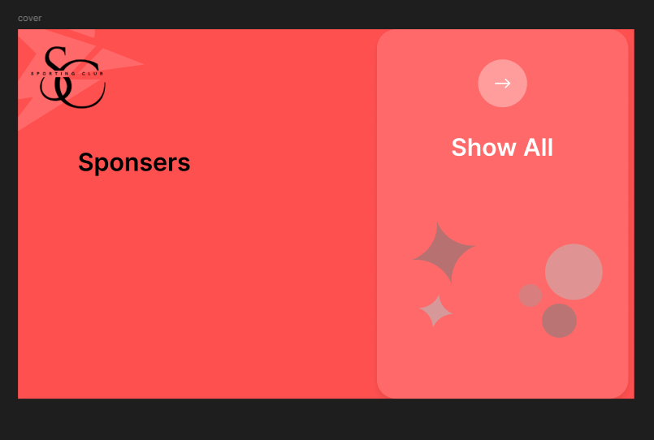
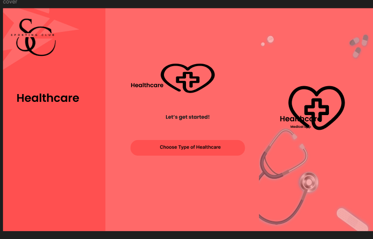
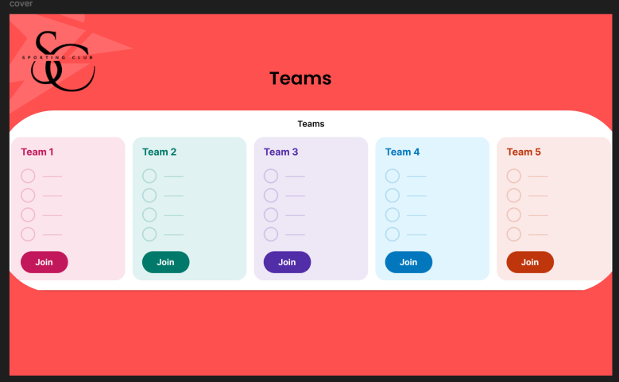
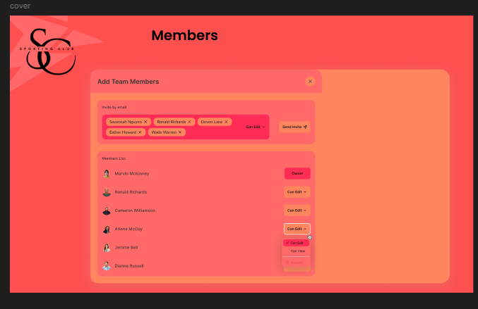

